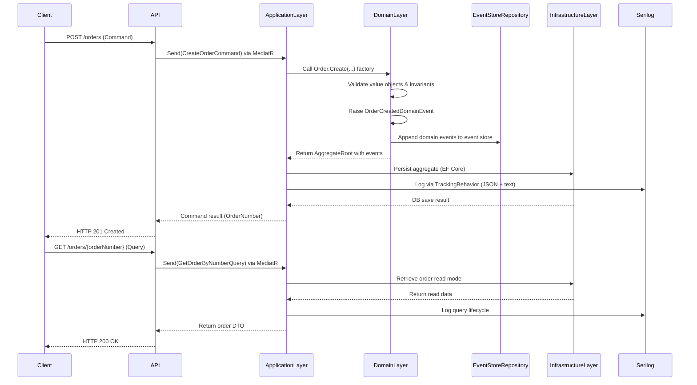
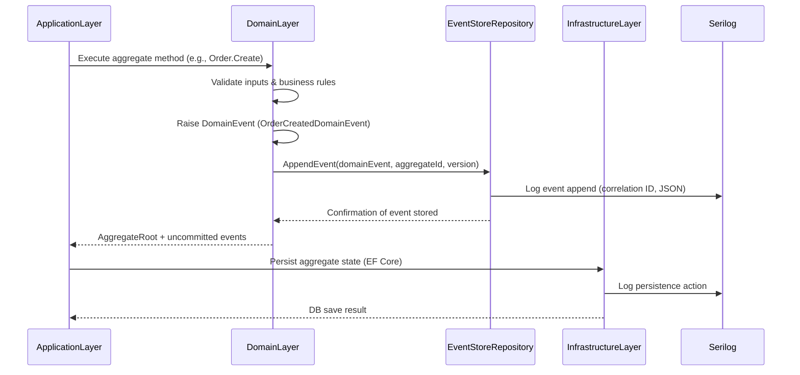

## Running the Project

```bash
dotnet run --project src/Order.Service.Api
```

Swagger UI:

```
https://localhost:7191/swagger
```

## Logging Setup

* `logs/app-YYYYMMDD.log` , General operational logs
* `logs/tracking-YYYYMMDD.json` , Event-based and correlation logs

## Architectural Notes

* **DDD** ensures high cohesion, low coupling, and rich domain modeling.
* **Event Sourcing** provides traceability and rebuild capability for aggregates.
* **CQRS** cleanly separates command and query concerns.
* **Value Objects** prevent invalid states.
* **TrackingBehavior** ensures full observability of request and event chains.

## A visual architecture diagram




##  Domain Event + Event Store persistence flow

