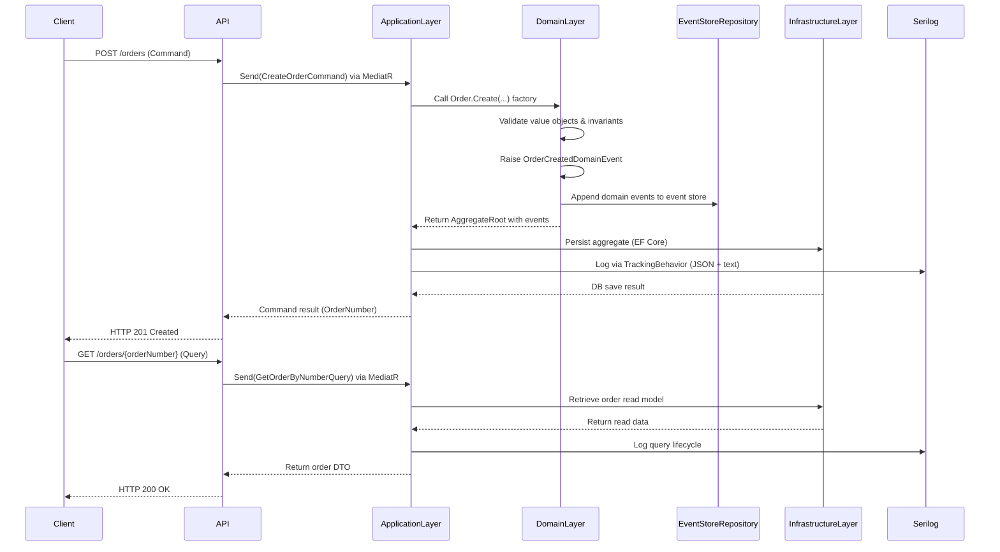
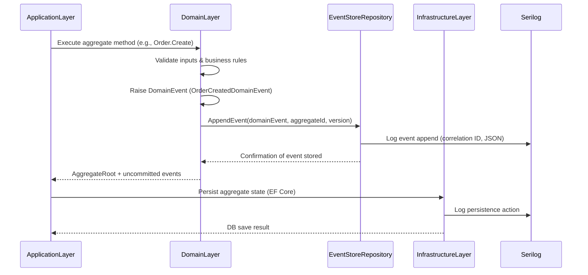
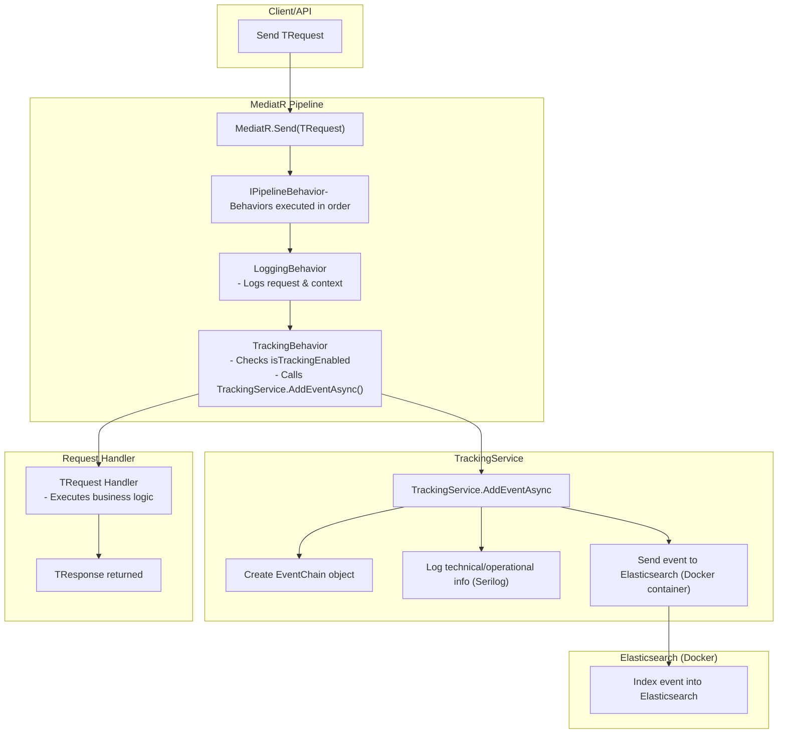

# Order Processing Microservice (.NET 9, DDD, CQRS, Event Sourcing, Elasticsearch Tracking)

## Overview

This microservice handles **Order Processing** via a REST API, built with **.NET 9** and advanced **Domain-Driven Design (DDD)** principles.
It supports **full CQRS**, **Event Sourcing**, and **rich domain behavior**, enabling the system to store and replay events to reconstruct aggregate state.
It includes robust **validation**, **structured logging with correlation IDs**, **event tracking to Elasticsearch**, and both **unit** and **integration** tests.

## Architecture

### Domain-Driven Design (DDD)

* `Order` is the **aggregate root**, implementing `IEventSourcedAggregate`.
* **Value Objects** for `CreditCard`, `Email`, and `Address` ensure immutability and self-validation.
* **Encapsulated collections** for `OrderItem`s, no direct list mutation.
* **Domain Events**:

  * `OrderCreatedDomainEvent`
  * `OrderItemAddedDomainEvent` (and other lifecycle events as needed)
* **Factories** for controlled aggregate creation.
* **Domain Services** for business logic that spans multiple aggregates.

### CQRS with MediatR

* **Commands** and **Queries** are isolated.
* Handlers implement `IRequestHandler<,>` for each request type.
* **Pipeline behaviors** for:

  * Validation
  * Tracking and correlation logging
  * Event store persistence

### Event Sourcing

* **`IEventStoreRepository<TAggregate>`** persists and retrieves domain events.
* **Event replay** rebuilds aggregates from historical events instead of loading from a traditional snapshot.
* Supports **auditability** and **debuggability** by keeping the full event history.

### Layered Structure

* **Domain**, Entities, Value Objects, Domain Events, Interfaces
* **Application**, Command/Query handlers, DTOs, Behaviors
* **Infrastructure**, Event Store persistence, EF Core, SQL storage

---

## Tech Stack

| Component     | Technology                                                |
| ------------- | --------------------------------------------------------- |
| Framework     | .NET 9 (ASP.NET Core API)                                 |
| Architecture  | DDD + CQRS + Event Sourcing                               |
| Event Store   | Custom `IEventStoreRepository` (JSON-based or DB-backed)  |
| Validation    | FluentValidation                                          |
| Database      | MSSQL (local)                                             |
| ORM           | Entity Framework Core                                     |
| Logging       | Serilog (structured, with correlation IDs & event chains) |
| Elasticsearch | Docker container for event tracking                       |
| Testing       | xUnit (unit + integration)                                |
| Documentation | Swagger (auto-generated)                                  |

---

## API Endpoints

### Create Order

**POST** `/orders`
Validates request, creates aggregate, raises `OrderCreatedDomainEvent`, persists to **Event Store**, and logs tracking event to Elasticsearch.

### Get Order by Order Number

**GET** `/orders/{orderNumber}`
Rebuilds the aggregate from **event history**.

---

## Features

* [x] **DDD Maturity**:

  * Aggregate roots
  * Value objects
  * Domain events
  * Encapsulated collections
  * Domain services
* [x] **CQRS**, Separate write/read paths with MediatR.
* [x] **Event Sourcing**, Persist and replay all domain events.
* [x] **FluentValidation**, Rich request validation.
* [x] **Serilog Structured Logging**, Includes correlation ID & request/event lifecycle tracking.
* [x] **Database Reset** (development mode).
* [x] **Swagger UI**, Live API exploration.
* [x] **Elasticsearch Tracking**, Docker container + test event support.

---

## Local Elasticsearch Setup (Docker)

This microservice uses **Elasticsearch** for tracking events and request lifecycles.

### 1️⃣ Pull Elasticsearch Docker image

```powershell
docker pull docker.elastic.co/elasticsearch/elasticsearch:8.10.0
```

### 2️⃣ Start Elasticsearch container

```powershell
docker run -d --name elasticsearch-local `
  -p 9200:9200 -p 9300:9300 `
  -e "discovery.type=single-node" `
  -e "xpack.security.enabled=false" `
  -e "ES_JAVA_OPTS=-Xms1g -Xmx1g" `
  docker.elastic.co/elasticsearch/elasticsearch:8.10.0
```

* HTTP endpoint: `http://localhost:9200`
* Single-node cluster, no TLS/auth for development.

### 3️⃣ Verify Elasticsearch Container

```powershell
docker ps
curl http://localhost:9200
```

Expected response:

```json
{
  "name": "6b9a8a207eac",
  "cluster_name": "docker-cluster",
  "version": { "number": "8.10.0" },
  "tagline": "You Know, for Search"
}
```

### 4️⃣ (Optional) Create an Ingest Pipeline

```powershell
curl -X PUT "http://localhost:9200/_ingest/pipeline/my-pipeline" -H "Content-Type: application/json" -d'
{
  "description": "Add processed timestamp to events",
  "processors": [
    { "set": { "field": "processedAt", "value": "{{_ingest.timestamp}}" } }
  ]
}'
```

### 5️⃣ Configure TrackingService in .NET

`appsettings.Development.json`:

```json
"Tracking": {
  "ElasticsearchUrl": "http://localhost:9200",
  "IndexPrefix": "tracking-events",
  "Username": "elastic", // optional
  "Password": "changeme", // optional
  "AutoRegisterTemplate": true,
  "IngestPipeline": null  // optional, set if using an ingest pipeline
},
```

---

## Ready-to-Use PowerShell Script for End-to-End Testing

Save this as `run-dev.ps1` in the project root:

```powershell
# run-dev.ps1

# 1️⃣ Pull Elasticsearch image
docker pull docker.elastic.co/elasticsearch/elasticsearch:8.10.0

# 2️⃣ Start Elasticsearch container if not running
$container = docker ps --filter "name=elasticsearch-local" --format "{{.Names}}"

if (-not $container) {
    Write-Host "Starting Elasticsearch container..."
    docker run -d --name elasticsearch-local `
      -p 9200:9200 -p 9300:9300 `
      -e "discovery.type=single-node" `
      -e "xpack.security.enabled=false" `
      -e "ES_JAVA_OPTS=-Xms1g -Xmx1g" `
      docker.elastic.co/elasticsearch/elasticsearch:8.10.0
    Start-Sleep -Seconds 15
} else {
    Write-Host "Elasticsearch container already running."
}

# 3️⃣ Run .NET API
Write-Host "Running .NET API..."
Start-Process -NoNewWindow -FilePath "dotnet" -ArgumentList "run --project src/Order.Service.Api"

Start-Sleep -Seconds 10 # give API time to start

# 4️⃣ Push a test order to API
$body = @{
    Items = @(@{
        ProductId = [guid]::NewGuid()
        ProductName = "Laptop Lenovo"
        ProductAmount = 1
        ProductPrice = 1002.43
    })
    InvoiceAddress = "Fake Street 04"
    InvoiceEmail = "fake@example.com"
    CreditCardNumber = "1111-2222-3333-0000"
} | ConvertTo-Json

Write-Host "Sending test order..."
Invoke-RestMethod -Uri "http://localhost:7191/orders" -Method POST -Body $body -ContentType "application/json"

# 5️⃣ Query Elasticsearch to verify event
Write-Host "Querying Elasticsearch..."
$response = Invoke-RestMethod -Uri "http://localhost:9200/tracking-events-$(Get-Date -Format yyyy.MM.dd)/_search?pretty"
$response.hits.hits | ForEach-Object { $_._source | ConvertTo-Json -Depth 10 }
```

### How to Run

1. Open **PowerShell** in Administrator mode.
2. Run:

```powershell
.\run-dev.ps1
```

* Starts Elasticsearch in Docker.
* Runs the .NET API.
* Sends a test order.

## A visual architecture diagram



##  Domain Event + Event Store persistence flow




## Flow Diagram: Tracking Request Pipeline
End-to-end flow diagram of how the TRequest interacts with MediatR, LoggingBehavior, TrackingBehavior, and TrackingService:


