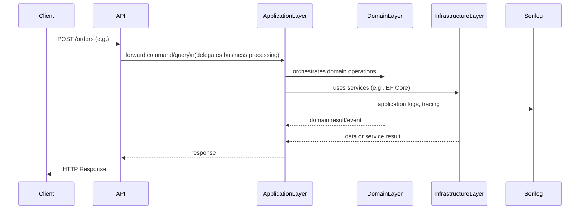

> ## Followed DDD principles, handled order processing, exposed three API endpoints, and included proper logging to track key events and errors.


## 1. **Domain-Driven Design (DDD) Structure**

Followed the **standard DDD layering**, which isolates concerns clearly:

| Layer              | Purpose                                                                                                                                     |
| ------------------ | ------------------------------------------------------------------------------------------------------------------------------------------- |
| **Domain**         | Core business logic (`Order`, `Event`, `State`, etc.)                                                                                       |
| **Application**    | Mediator-based request handling (`CreateOrderCommandRequestHandler`, `GetOrderByIdQueryRequestHandler`, `DeleteOrderCommandRequestHandler`) |
| **Infrastructure** | Repositories, EF Core, tracking/logging, file and DB access                                                                                 |
| **API**            | Minimal HTTP layer for exposing endpoints                                                                                                   |

**Benefits:**

* Testability
* Separation of concerns
* Encapsulated business logic

## 2. **Microservice Behavior: Handles Order Processing**

Implemented business use cases such as:

* `CreateOrderCommandRequestHandler`
* `GetOrderByIdQueryRequestHandler`
* `DeleteOrderCommandRequestHandler`

Each handler:

* Accepts a request
* Uses a repository to fetch or persist domain entities
* Logs meaningful events during processing

**Example:**

```csharp
public Task AddEventAsync<TRequest, TInput>(TRequest request, CancellationToken cancellationToken = default)
    where TRequest : ITrackingRequestBase<TInput>
{
    if (request == null) throw new ArgumentNullException(nameof(request));
    
    var logData = new EventChain
    {
        Id = request.CorrelationId,
        CorrelationId = request.CorrelationId,
        CanonicalType = request.CanonicalType,
        Events = [request.Event]
    };

    using(Serilog.Context.LogContext.PushProperty("IsTracking", true))
    {
        _logger.Information("Tracking event: {@LogData}", logData);
    }        

    return Task.CompletedTask;
}
```

This ensures each service action is **auditable and traceable**.

## 3. **Three API Endpoints**

The endpoints (via Minimal API ) are:

* `POST /orders` → creates an order
* `GET /orders/{id}` → retrieves an order
* `DELETE /orders/{id}` → deletes an order

Each maps directly to a **MediatR command or query**, so the application layer stays clean and composable.

## 4. **Proper Logging with Serilog**

### General Logging

Log application-level information to `logs/app-20250805_002.log`, e.g.:

```csharp
logger.LogInformation("Order created with ID {OrderId}", order.Id);
```

### Tracking Logging

Introduced **structured, contextual tracking** using:

* `TrackingContext` (scoped)
* `EventChain` with multiple `Event`s during request flow
* Final log message emitted once in middleware:

```csharp
using(Serilog.Context.LogContext.PushProperty("IsTracking", true))
 {
     _logger.Information("Tracking event: {@LogData}", logData);
 }
```

This log is:

* Written only **once per request**
* Stored separately in `logs/tracking-.log`
* Easily queryable by `CorrelationId`

**Why it matters:**

* Debugging is easier (you get full request history)
* Logs are not polluted with EF Core or unnecessary noise
* Tracking is decoupled from business logic

## 5. **Separation of Tracking from General Logs**

Configured Serilog like so:

```csharp
.WriteTo.Logger(lc => lc
    .Filter.ByExcluding(Matching.WithProperty<object>("IsTracking", v => v is bool b && b))
    .WriteTo.File("logs/app-.log", rollingInterval: RollingInterval.Day))

.WriteTo.Logger(lc => lc
    .Filter.ByIncludingOnly(Matching.WithProperty<object>("IsTracking", v => v is bool b && b))
    .WriteTo.File(path:"logs/tracking-.json",
    rollingInterval: RollingInterval.Day,
    formatter: new Serilog.Formatting.Json.JsonFormatter(renderMessage: true)))
```

This ensures:

* Operational logs go to `app-20250805_002.log`
* Event-level tracking goes to `tracking-20250805_002.log`

## 6. **Correlation ID Support**

Store and pass around a `CorrelationId`, which:

* Ties multiple events in a request together
* Enables distributed tracing across services (future-ready)

This is set in the `TrackingContext` and logged with every tracking event.

## Summary: How the Goal was Achieved

| Requirement                    | Implementation                                                                                         |
| -------------------------------| ------------------------------------------------------------------------------------------------------ |
| DDD Architecture               | Clean separation: Domain, Application, Infrastructure, API                                             |
| Order Processing Logic         | `CreateOrderRequest`, `OrderQueryRequest`, `DeleteOrderRequest`, proper encapsulation of domain events |
| Three API Endpoints              | `POST /orders`, `GET /orders/{id}`, `DELETE /orders/{id}` with MediatR behind them                     |
| Proper Logging                 | Serilog with structured logs and log context                                                           |
| Tracking Key Events and Errors | `TrackingContext` aggregates events, logs once per request in JSON                                     |
| Correlation ID Support         | Per-request context passed across handlers, logs, and events                                           |
| Log Separation                 | `app-20250805_002.log` for general logs, `tracking-20250805_002.log` for event chains                  |


## A visual architecture diagram




### Notes:

* **Client** initiates the request.
* **API** just forwards to the **ApplicationLayer**.
* **ApplicationLayer** is the orchestrator, coordinating **DomainLayer** and **InfrastructureLayer**.
* **DomainLayer** is passive but central for business rules.
* **InfrastructureLayer** handles persistence and external concerns.
* **Serilog** logs operational events and traces.


